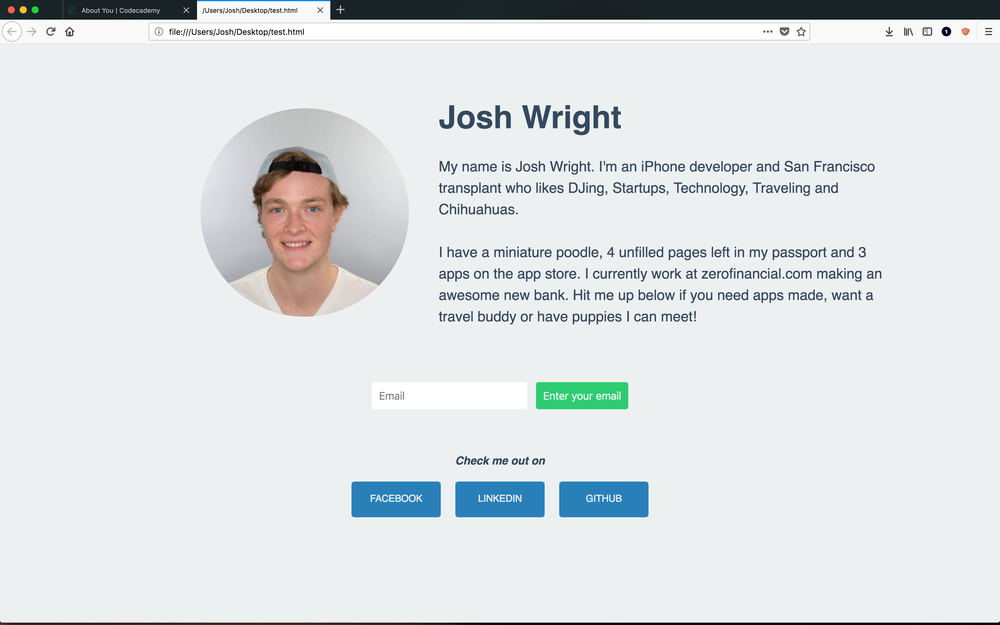

# NDV Hour of Code 2017
**December 5, 2017**

## Intro

Today we are going to be learning about making websites. Our goal is to create a personal website using HTML and CSS and then upload it to the Internet for everyone to see!

## Technologies

You are going to learn about a few different technologies to help you on your way to web-fame. Here is a reference of them in case you get confused:
- **HTML + CSS**: two languages used to describe what is on a website. They describe the elements such as images and text as well as the style of them (color, font, etc).

- **VSCode**: a 'Text Editor' (like Word or Pages, except for writing code)

- **GitHub**: a website used to put code you make on the Internet. It can also be used to upload a simple website, which is how we will use it.

- **Codeacademy**: a website with free and paid programming tutorials. While a lot of the advanced ones are paid, many of the beginner ones are free and a great place to get your feet wet

## Outline
1. Creating a personal site using Codeacademy
2. Improving your site locally using VSCode
3. Uploading the site to GitHub pages
4. Bonus: Fotune telling with JavaScript

## 1. Creating a personal site using Codeacademy
Using your favorite web browser open [this tutorial](https://www.codecademy.com/courses/web-beginner-en-3pc6w/0/1) from Codeacademy. Follow the tutorial and when you are done proceed to part 2.

**NOTE**: In `5. Adding Style` of the tutorial there seems to be a bug where it won't let you continue. Copy, then delete everything except your `<style>` tags to get the tutorial to let you continue. When you are on the next step re-paste what you copied from before.

## 2a. Setting setting up VSCode

Just to recap step 1: HTML is a language that a web browser uses to draw websites. You give the browser HTML and it draws a website. Inside the `<style> ... </style>` tags, you wrote an additional language, CSS. The web browser uses that to style the HTML you've given it (centering, changing fonts, changing colors, etc). CSS is always written in the `<style> ... </style>` tags in a `.html` file

Codeacademy had a built in section of its website that rendered the code you had written, but any web browser can actually do that as well. To see this in action we need to do a couple things.

First, we need a program to edit our HTML, just like you were able to on the Codeacademy webste. There are lots of programs that can do this, but a great one for both Mac and Windows is Visual Studio Code by Microsoft. Head over to [VSCode's site](https://code.visualstudio.com/) and download it.

Once you've downloaded it, open it up and close out of the initial `Welcome` page that pops up. Then go to `File -> New File` (hotkey `cmd + n`).

You should have a blank text file right now. Go back to your window from CodeAcademy and copy and past all of your code into the new file you just created. When you've done that, go to `File -> Save As...` and save the file as `index.html` on your desktop. 

Note: The `.html` extension at the end of the file name is important, don't forget it! This tells your computer and web browser that this is a file is a website.

Once you've saved your file, go ahead and double click the file on your desktop. It should automatically in a web browser (if it doesn't, try right clicking and hit open with -> Safari). 

You should now see the website you made in the web browser. You are 1 step closer to having your personal site on the Internet, nice work!

Before making this website public, however, it could really use some cleanup. I'm definitely not a designer, but I wouldn't exactly write home to mom about this. Lets make a few changes.

## 2b. Site improvement

Right now the site looks like this:


After this section your site will look a little more presentable:



If you followed along with the codeacademy tutorial, the stuff inside your `<body>` tags should look like this:

```html
<body>
    
    <p>Hi! I am learning how to make
    my very own web page! I really like
    blueberry muffins and long walks on
    the beach.</p>
    <input placeholder="Email" type="email">
    <input type="submit">
</body>
```

Lets get started by organizing this a little. In HTML you can use the `<div>` tag to wrap sections of your site. Looking at the second website screenshot above there are roughly 3 seconds of the site; the 'info' section (image and text) the 'input section' (enter your email) and a new 'links' section. Lets create a `<div>` for each of those sections, inside the `<body>`:

```html
<body>
    <div>
        
        <p>Hi! I am learning how to make
        my very own web page! I really like
        blueberry muffins and long walks on
        the beach.</p>
    </div>
    <div>
        <input placeholder="Email" type="email">
        <input type="submit">
    </div>
    <div>
        <!--> Nothing here yet <-->
    </div>
</body>
```

Note that it's typical to use indentation to keep things easy to follow. 

**CSS classes**: as you saw in the Codeacademy tutorial, you can style custom elements such as `p` with `p { }` sections in your style. You can also use 'classes' to accomplish the same thing. After an element name type `class="className"` and you can now style that element (any any others of that class) with a `.className { }` style block. Lets add a class for each of our sections:

```html
<body>
    <div class="info">
        ...
    </div>
    <div class="input">
        ...
    </div>
    <div class="links">
        ...
    </div>
</body>
```

Lets also add a couple of extra items to our profile. Lets add your name in `<h1>` blocks, before the paragraph and after the image. 

```html
<body>
    <div class="info">
        
        <h1>Josh Wright</h1>
        <p>Hi! I am learning how to make
        my very own web page! I really like
        blueberry muffins and long walks on
        the beach.</p>
    </div>
    ...
</body>
```

We can also take a moment to updated the `<p>` tag with a description of yourself. Use `<br/>` inside the `<p></p>` tags to add a new line or two (like hitting enter/return in Word).

```html
<body>
    <div class="info">
        ...
        <p>
            My name is Josh Wright. I'm an iPhone developer and San Francisco transplant who likes DJing, Startups, Technology, Traveling and Chihuahuas.
            <br/>
            <br/>
            I have a miniature poodle, 4 unfilled pages left in my passport and 3 apps on the app store. I currently work at zerofinancial.com making an awesome new bank. Hit me up below if you need apps made, want a travel buddy or have puppies I can meet!
        </p>
    </div>
    ...
</body>
```

Also lets update that photo to an actual picture of you. If you aren't sure what a url to a photo of you online is, try going to facebook or twitter, right clicking your profile picture and selecting `View Image` or `View Image Source`. Then copy that url and paste it into the `` tag `src` part. Bump the height and widths up to 350 each as well.

```html
<body>
    <div class="info">
        
        ...
    </div>
    ...
</body>
```

Finally, lets add the links to the bottom. You can add a hyperlink using the `<a>` tag with the 'href' attribute like so: `<a href="www.linklocation.com">Link Title Here</a>`. Lets add a title in `<h3>` tags and at least three of those to various profiles you have on the web, inside the `<div>` of class "links". Lets give each of these links a class of "link"

```html
<body>
    ...
    <div class="links">
        <!-- The <i> tags a text italicized -->
        <h3><i>Check me out on</i></h3>

        <!-- Put your own social media profiles and titles here -->
        <a class="link" href="https://www.facebook.com/joshuawright11">FACEBOOK</a>
        <a class="link" href="https://www.linkedin.com/in/joshlwright/">LINKEDIN</a>
        <a class="link" href="https://github.com/joshuawright11">GITHUB</a>
    </div>
</body>
```

Alright, thats about every element in the second site from above. We're done, right? Save this file and open it up in the web browser...


Well, we can see the new elements, but they are pretty much unreadable and look pretty lousy. In the next section we will clean style everything to look nice with CSS.

By the way, your `index.html` should look something like [this](site-progress.html) right now.

## 2c. Styling with CSS

Note: CSS can be a little tricky/unintuitive at first, so if you don't understand everything in this next section that's okay! Just do your best to follow along and see if you can figure out whats going on.

First things first lets kill the background image. Nothing against Van Gough, but its a little much. Lets set it to a solid color as well as remove some unnecessary features. Also change the colors and fonts of the p and h1 elements:

Replace the `body` and `p` styles with the following:

```html
<head>
    <style>
        body {
            background: #ecf0f1;
            color: #34495e;
            font-family: Helvetica;
        }

        h1 {
            font-size: 40pt;
        }

        p {
            font-size: 18pt;
            /* an 'em' refers to the height of one character in the text's font*/
            line-height: 1.5em;
        }
        ...
    </style>
</head>

<body>
    ...    
</body>
```

**Note**: CSS uses `hex` to describe colors. This is a special way of defining a color using a `#` folowed by 6 letters and numbers. Just not that if you see something like `#17afb4` that's just a color.

Lets start by getting the info section looking good. Before writing any style (CSS) lets make one more html change. The info section can really be divided into two sections, left (image) and right (name and description) so lets wrap that content in `<div>` tags and give those a class of `.infoLeft` and `.infoRight`.

```html
...
<body>
    <div class="info">
        <div class="infoLeft">
            
        </div>
        <div class="infoRight">
            <h1>Josh Wright</h1>
            <p>
                My name is Josh Wright. I'm an iPhone developer and San Francisco transplant who likes DJing, Startups, Technology, Traveling and Chihuahuas.
                <br/><br/>
                I have a miniature poodle, 4 unfilled pages left in my passport and 3 apps on the app store. I currently work at zerofinancial.com making an awesome new bank. Hit me up below if you need apps made, want a travel buddy or have puppies I can meet!
            </p>
        </div>
    </div>
    ...
</body>
```

CSS has a useful tool called [flex](https://www.w3schools.com/cssref/css3_pr_flex.asp) that lets you define a container with the `display: flex` property. Any elements inside this container will now layout proportially based on their own `flex` property. For example, if we have 2 elements inside a container with flex and element a has `flex: 1` while element b has `flex: 2`, element b will be twice the size of a.

We can use this concept in our info section. Add the following inside your style tags:

```html
<head>
    <style>

        ...

        .info {
            display: flex;  /* 1. */
            margin: 0 auto; /* 2. */
            width: 1330px;  /* 3. */
        }

        .infoLeft {
            flex: 2; /* 4. */
            padding-right: 50px; /* 5. */
        }

        .infoRight {
            flex: 3; /* 4. */
            margin: auto; /* 6. */
        }
        ...
    </style>
</head>
```

Heres what we did:
1. Set the container to flex

2. Set the container to have a margin (like padding) of 0 on the top/bottom and 'auto' on the left and right (auto means it centers itself). Padding is the space between the content of an element and its edge, whereas margin is the space outside the edge.

**Note** margin can take 1, 2 or 4 arguments. The syntax is as follows:
margin: 4; All (top bottom left right) margins will be 4
margin: 4 8; top/bottom margins will be 4, left/right will be 8
margin: 1, 2, auto, 4; top = 1, right = 2, bottom = auto, left = 4

3. Set the width of the info section to 1330 pixels. This is not a magic number just a size that looked good (most screens are 1920 pixels wide so this gives some nice whitespace on the side). 

4. Set the flex values of the two info sub-elements (they will fill their container with a 2:3 ratio infoLeft : infoRight)

5. add some right padding to the infoLeft class (the image)

6. Set all margins of infoRight to 'auto' meaning that the text on the right centers itself nicely.

Save the file and refresh the browser and... it looks... better. Not quite there but getting less painful.

One thing that could be cleaned up is the image; right now it's in an awkward position off to the side.

Clean it up by adding the following:
```css
img {
    display: block;     /* 1 */
    margin-right: 0 0 0 auto; /* 1 */
    border-radius: 50%; /* 2 */
    padding: 100px 0;   /* 3 */
}
```

1. By setting the right margin to `auto` and all others to 0 causes the image to hug whatever is to its right (the text). `display: block` is needed for this behavior to occur.

2. This clips the corners of the image with a radius of 50% of its height (aka makes it a circle)

3. `padding` has the same 1, 2, 4 value syntax as `margin` so this adds padding of 100 pixels to the top and bottom of the image.

Save, refresh browser and voila! You're site should look something like this at this point:


Not bad!

Now lets clean up the `input` section. Nothing crazy going on here, we're just adding a corner radius to elements and changing a few colors, fonts, and margins.

Replace all input CSS with the following:

```css
input {
    border: 0;
    padding: 12px;
    margin: 0px 5px;
    font-size: 18px;
    border-radius: 4px;
}

input[type="submit"] {
    background: #2ecc71;
    color: #ecf0f1;
}

.input {
    margin: 10px;
    text-align: center;
    padding: 0 0 60px 0;
}
```

Hopefully nothing here looks too crazy. We tweak the font sizes and colors of the input elements. We also center the elements on the screen using `text-align: center`. Note the difference here between `input` and `.input`. `input` refers to any HTML `<input>` elements. `.input` refers to the custom "input" class we defined in the HTML (`<div class="input">`).

Looking good! Last step is to make those links at the bottom look nice. We can center them all by using `text-align: center;` on the links container.

```css
.links {
    text-align: center;
}
```

Last step is to make the link buttons themselves look nice. We can get those rounded blue buttons from above by adding the following styles to the `.link` class:

```css
.link {
    background: #2980b9;
    line-height: 60px;     /* 1 */
    font-size: 12pt;
    width: 150px;
    display: inline-block;  /* 2 */
    margin: 5px 10px;
    color: #ecf0f1;
    border-radius: 5px;
    text-decoration: none; /* 3 */
}
```

The only things here you haven't seen are:
1. `line-height: 60px;`: this is used to set the height of the button while keeping the text inside it centered vertically (if the plain old height property was used here the link text would stick to the bottom of the button).

2. `display: inline-block;`: required for the link to expand to fit the `line-height` and `width` we gave it. CSS is weird.

3. Clear the underline that links have by default.

And thats it! Save, refresh the browser and you should have your very own shiny website. Nice work!

If you got lost at all along the way and missed a couple of steps the final version of what the site should look like is [here](site-final.html).

## 3: Uploading to the Internet
For this next part you will need to create a free account on [GitHub.com](https://github.com/). Once you do that, follow [the steps to upload a site to GitHub pages](https://pages.github.com/) to upload your site to the Internet. GitHub is an online host of 'repositories' which are essentially folders of files with code. To view your site via GitHub pages you essentially need to create a repository with a special name and add your website file to it. The link above should describe that in more detail but feel free to ask me for help if you get stuck!

## 4: BONUS
Ask Josh for the bonus activity if you get this far.